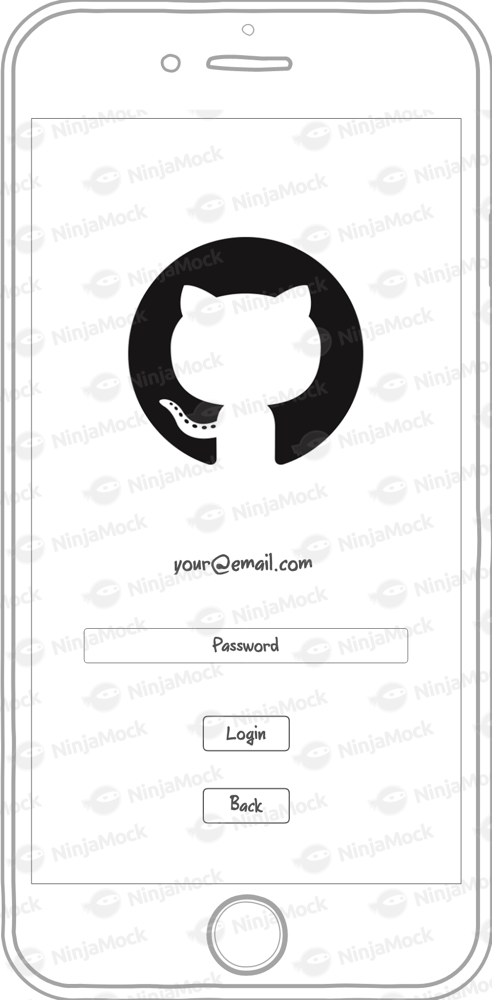
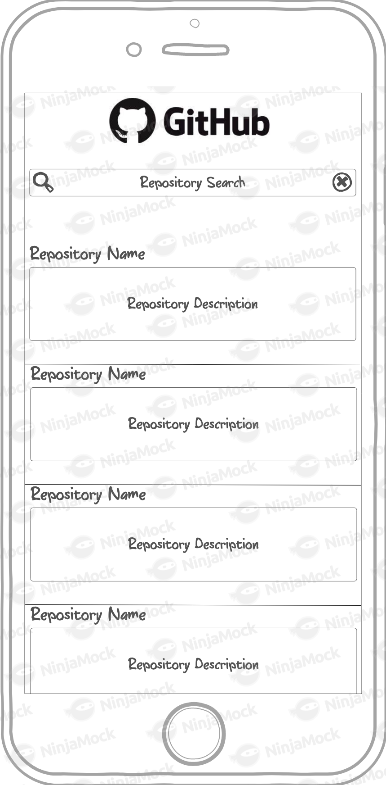
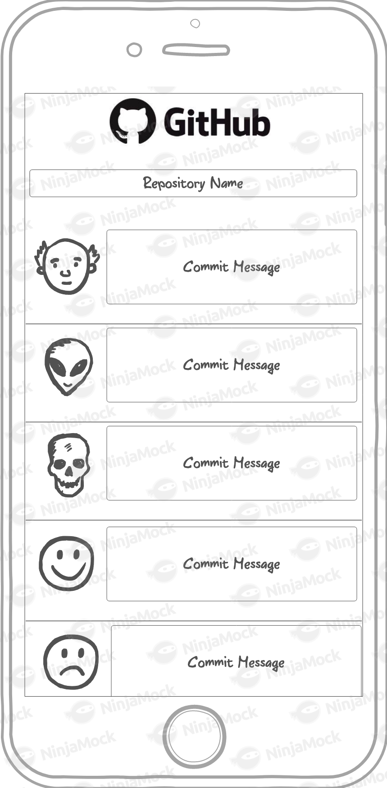
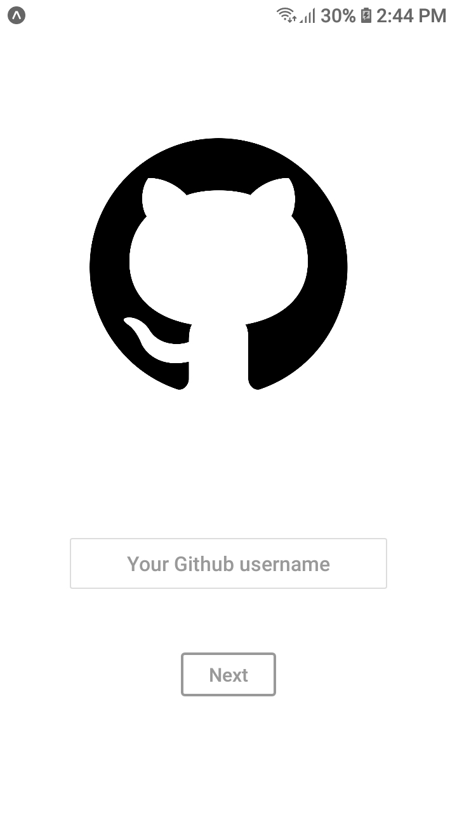
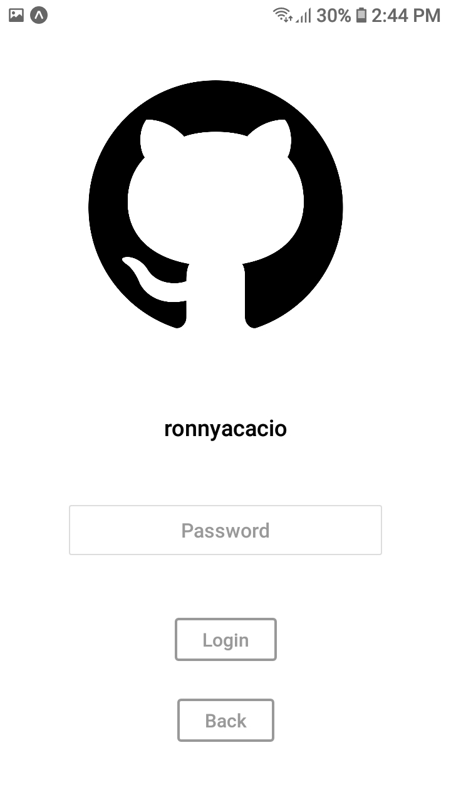
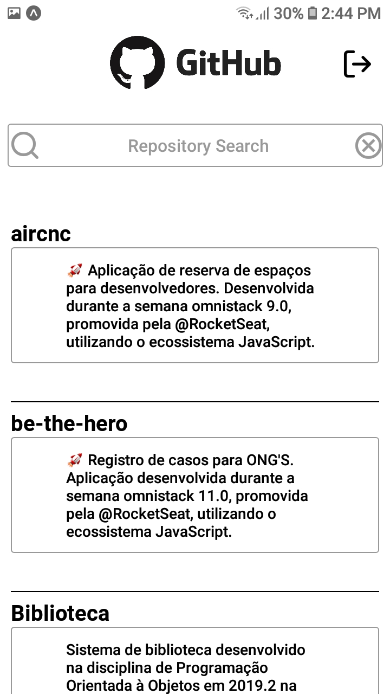
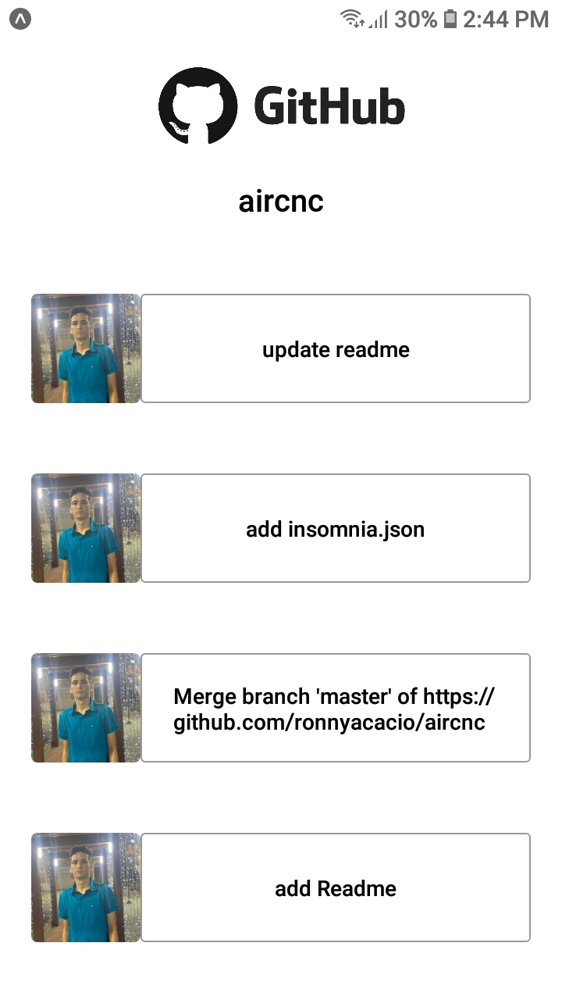

<h1 align="center">
    
</h1>

<h4 align="center">
  🎯 Desafio mobile Creditas
</h4>

 

### **Desafio**

| Login                   | Login                   | Repositories                  | Commits                  |
| ----------------------- | ----------------------- | ----------------------------- | ------------------------ |
|  |  |  |  |

 

### **Resultado**

| Login                    | Login                    | Repositories                   | Commits                   |
| ------------------------ | ------------------------ | ------------------------------ | ------------------------- |
|  |  |  |  |

## ⚡ Tecnologias

- **react-native**
- **expo**
- **react-navigation**
- **axios**
- **react-native-gesture-handler**

## 💻 Projeto

Esse projeto visa completar o desafio proposta pela [Creditas](https://github.com/Creditas), visando aumentar as minhas habilidades em quanto desenvolvedor. Um app que lista os seus repositórios e commits do github depois de uma autenticação Basic.
